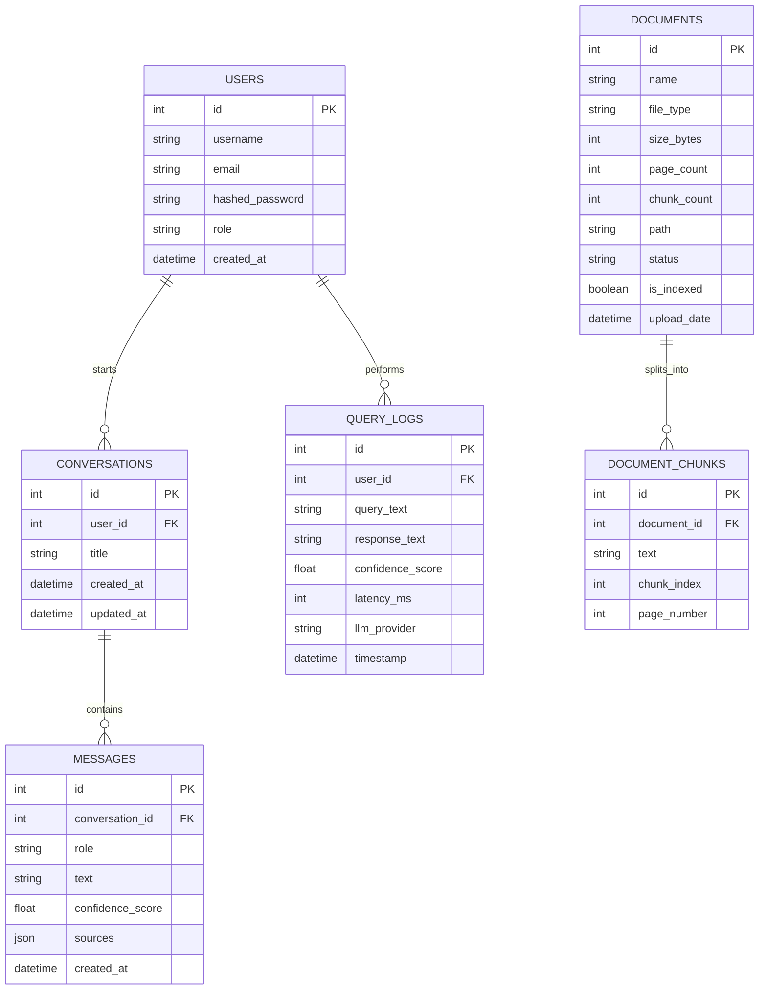

# Intelligent Customer Support AI Assistant (RAG Pipeline)

A production-ready, modular, and containerized Customer Support Assistant utilizing Retrieval-Augmented Generation (RAG) to answer user queries using company documents (PDF, DOCX, TXT) and FAQs. Built with **FastAPI**, **React (Vite + TypeScript + Tailwind)**, **FAISS**, and **PostgreSQL**.

---

## Key Features

- **Multi-format Knowledge Base:** Uploads, cleans, page-tracks, and indexes PDF, DOCX, and TXT documents.
- **Dynamic Re-indexing:** Dynamic re-indexing of FAISS indexes whenever documents are added or deleted.
- **Double-Layer Guardrails:** 
  - *Similarity Threshold Guardrail:* Skips model invocations and returns `"I don't know."` if query similarity is below the threshold.
  - *Context-Engine Guardrail:* Prompt-bound system instruction forcing the LLM to output exactly `"I don't know."` if retrieved context is insufficient, preventing hallucinations.
- **Rich Citation Engine:** Shows the exact document names and matching similarity percentage for every answer.
- **Session Memory:** Retains multi-message context to support follow-up discussion threads.
- **Operations Analytics Dashboard:** Admins can monitor system-wide averages for latency, query volume, similarity confidence, and active LLM distributions.

---

## System Architecture

```mermaid
graph TD
    %% Upload Flow
    A[Admin Uploads File] -->|Validate Ext| B[Text Extraction Engine]
    B -->|PyMuPDF/pdfplumber/docx| C[spaCy Text Normalizer]
    C -->|Recursive Sliding Window| D[Document Chunker]
    D -->|Write Chunks| E[(PostgreSQL DB)]
    D -->|Generate MiniLM Embeddings| F[FAISS Vector Store]
    
    %% Query Flow
    G[User Query Input] -->|Generate Query Embedding| H[FAISS Semantic Search]
    F -->|Cosine Similarity Lookup| H
    H -->|Retrieve Top-K Chunks| I{Similarity Threshold Check}
    I -->|Below Threshold < 0.3| J[Instantly return "I don't know."]
    I -->|Above Threshold >= 0.3| K[Assemble Chat History + Context Prompt]
    K -->|System Directive Guardrail| L[Google Gemini / OpenAI GPT API]
    L -->|Evaluate Answer| M{Is sufficient info present?}
    M -->|No| N[Return "I don't know."]
    M -->|Yes| O[Return Answer + Sources + Confidence Score]
```

### Relational Database Schema (ER Diagram)



---

## Quickstart Guide

### Option A: Complete Docker Compose Build (Recommended)

To run the database, backend services, and front-end interface in isolated, orchestrated containers, run:

1. Copy `.env.example` to `.env`:
   ```bash
   cp backend/.env.example backend/.env
   ```
2. Set your actual **`GEMINI_API_KEY`** or **`OPENAI_API_KEY`** in `backend/.env`.
3. Build and launch all services:
   ```bash
   docker-compose up --build
   ```
4. Access the web interface at **`http://localhost:5173`**.
5. The API Swagger Docs will be available at **`http://localhost:8000/docs`**.

---

### Option B: Local Manual Setup

#### 1. Database Configuration
Ensure a PostgreSQL database named `customer_support_db` is running on `localhost:5432`.

#### 2. Backend API Setup
```bash
cd backend
# Create virtual environment
python3 -m venv .venv
source .venv/bin/activate

# Install dependencies
pip install -r requirements.txt

# Run Unit and Integration tests
pytest

# Start the FastAPI Server
uvicorn app.main:app --reload --port 8000
```

#### 3. Frontend Portal Setup
```bash
cd frontend
# Install dependencies
npm install

# Start Vite live reload development server
npm run dev
```
Open **`http://localhost:5173`** in your browser.

---

## Rest API Endpoint Reference

All endpoints (except Authentication and Health) are protected and require a `Authorization: Bearer <JWT_TOKEN>` header.

### Authentication Router (`/api/auth`)
- `POST /register` — Register account. The first registered account automatically becomes `admin`.
- `POST /login` — Validates credentials, returns JWT bearer token.
- `GET /me` — Retrieves current user profile.

### Document Router (`/api/documents`)
- `POST /upload` — **Admin-Only.** Uploads a file (PDF, DOCX, TXT) and vectors it into FAISS.
- `GET /` — Lists all uploaded files in the workspace.
- `DELETE /{id}` — **Admin-Only.** Deletes a file, purging its chunks and rebuilding FAISS index.
- `POST /reindex` — **Admin-Only.** Manual trigger to rebuild FAISS index from Postgres.
- `GET /stats` — **Admin-Only.** Analytical statistics on uploaded file breakdowns.

### Chat & Support Router (`/api/chat`)
- `GET /conversations` — Fetch user's conversation threads.
- `POST /conversations` — Start a new chat thread.
- `GET /conversations/{id}` — Fetch conversation details with all historical messages.
- `DELETE /conversations/{id}` — Delete a thread.
- `POST /conversations/{id}/messages` — Submit a question, triggers the RAG pipeline.
- `POST /conversations/{id}/clear` — Clear messages in a thread.
- `GET /query-logs` — **Admin-Only.** Audits system-wide query history logs.
- `GET /analytics` — **Admin-Only.** Operations KPIs dashboard (averages for confidence, latency, volume, daily distributions).

---

## Seeding Sample Documents to Test

The repository contains pre-loaded sample documents for testing:
1. `sample_faq.txt` — Standard operational instructions covering business working hours, passwords, and support desks.
2. `sample_terms.txt` — E-commerce refund policies, trial details, and returning rules.

**To verify the "I don't know" mandate:**
- Ask: *"What are our office operational hours?"* -> Returns verified support working details with high similarity.
- Ask: *"What is the capital of France?"* or *"Who won the 2022 World Cup?"* -> Bypasses LLM completion and returns exactly:
  **`I don't know.`**
